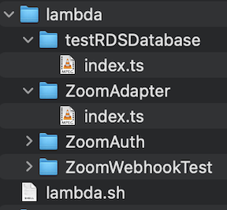

# Lambda319 Backend

* [For Dev setup](#for-dev-setup)
* [To maintain repo structure & compatibility](https://github.com/Lambda319/BackEnd/edit/LambdaSetup/README.md#to-maintain-repo-structure--compatibility-with-lambda-script)
* [To upload to AWS-Lambda](#to-upload-to-aws-lambda)
    + [Uploading a new function](https://github.com/Lambda319/BackEnd/edit/LambdaSetup/README.md#uploading-a-new-function-not-present-in-aws-lambda)
    + [Updating existing functions](#updating-existing-functions)

## For Dev setup

- setup AWS CLI (see AWS for instructions)

## To maintain repo structure & compatibility with lambda script

- Create a lambda function in AWS Console
- Create a folder inside 'lambda/'
    - This folder is case sensitive, it must match exactly the lambda function name in AWS, and cannot contain any
      spaces
- Create and edit your `index.js` file inside your newly created folder

> Example structure: </br>

## To upload to AWS-Lambda

- The script was only tested on macOS, only works on unix env
- Required packages: aws-cli (see above setup instructions)
    - The script will complain if `aws-cli` is missing _on macOS only_.
- The script does not build node_modules. If using modules, use layers in AWS instead.

Note: Depending on your environment, you may need to use `sudo` for some/all of the commands below

### Uploading a new function (not present in AWS-Lambda)

###### Requirements

- Make sure you are in the project's root dir
- The function must not exist in AWS
- The folder name must not contain a space
- A role matching the function's name must not exist.
    - This will only happen if you've attempted to run this script and it failed after creating a role.
    - If this happens, delete the role in IAM or create the function manually on AWS and then update the function as
      described [here](#updating-an-existing-function)
- You must ensure your function is in `./lambda/xyz/index.js`, where xyz is your folder name

###### Usage

- `./lambda.sh --create xyz`
    - where xyz is the name of the folder containing a single index.js
    - Alternatively, xyz can also be the path `lambda/funcname`
- The script will create a role in _IAM_, attach _CloudWatch_ permissions, and then upload the function to _AWS Lambda_.

<br></br>

### Updating existing functions

###### Requirements

- Make sure you are in the project's root dir
- The function must already exist in AWS

#### Updating a single function

- `./lambda.sh xyz`
    - xyz is the name of your lambda function. The folder you created must also match this name exactly
    - Alternatively, xyz can also be the path `lambda/funcname`

#### Updating all functions

- ```./lambda.sh -a```
    - This will upload all valid lambda functions to aws.
    - If using this option, all functions present locally must already exist in AWS, otherwise this will fail

Use with care. **These actions cannot be undone**. Make a commit or create a version in AWS before uploading if you have
any doubts.


